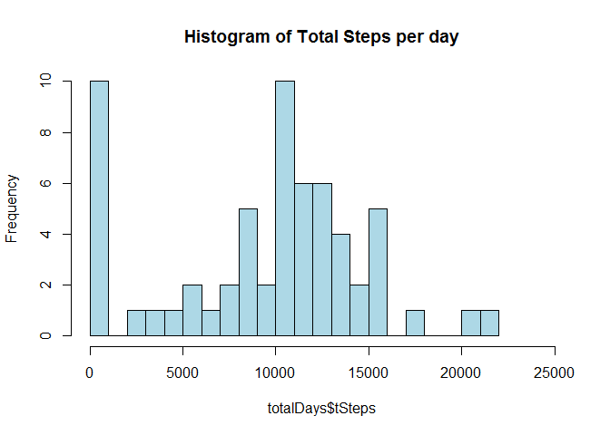
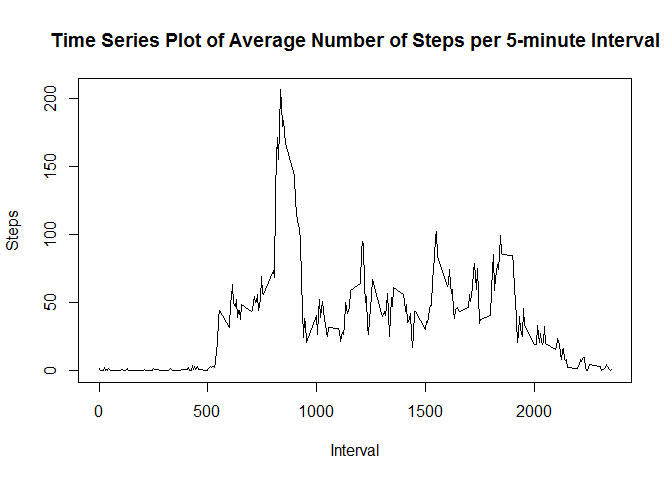

# Reproducible Research: Peer Assessment 1


### Loading and preprocessing the data


**The assumption for this exercise is that the datafile is in the same directory as the R markdown file.** 

We start by reading in the datafile and verifying that it has the full set of 17,568 observations.  


```r
# afile <- read.csv("activity.csv", as.is=TRUE)
afile <- read.csv("activity.csv")
nrow(afile)
```

```
## [1] 17568
```

```r
str(afile)
```

```
## 'data.frame':	17568 obs. of  3 variables:
##  $ steps   : int  NA NA NA NA NA NA NA NA NA NA ...
##  $ date    : Factor w/ 61 levels "2012-10-01","2012-10-02",..: 1 1 1 1 1 1 1 1 1 1 ...
##  $ interval: int  0 5 10 15 20 25 30 35 40 45 ...
```

```r
head(afile)
```

```
##   steps       date interval
## 1    NA 2012-10-01        0
## 2    NA 2012-10-01        5
## 3    NA 2012-10-01       10
## 4    NA 2012-10-01       15
## 5    NA 2012-10-01       20
## 6    NA 2012-10-01       25
```

```r
tail(afile)
```

```
##       steps       date interval
## 17563    NA 2012-11-30     2330
## 17564    NA 2012-11-30     2335
## 17565    NA 2012-11-30     2340
## 17566    NA 2012-11-30     2345
## 17567    NA 2012-11-30     2350
## 17568    NA 2012-11-30     2355
```

The variables in the dataset are:

  - steps - the number of steps taken in 5-minute intervals (missing values are coded as NA)
  
  - date  - the date the measurements were taken in YYYY-MM-DD format
  
  - interval - Identifier for the 5-minute interval in wqhich the measurement was taken
  
The data are formatted numeric (steps, interval) and factors (date) after being read into a dataframe.  We also notice from the head() and tail() functions that there are some NA's in the steps variable.  


### What is mean total number of steps taken per day?

For this part, we want to answer several question of the data. We will ignore the missing values in the dataset.


1. Calculate the total number of steps taken per day
2. Make a histogram of the total number of steps taken each day.
3. Calculate and report the mean and median of the total number of steps taken per day.

To calculate the total numebr of step, we'l use aggregate(), passing it the sum function.  We'll store the results in a table, totalSteps  with to variables, tDate and tSteps.


```r
totalDays <- aggregate(afile$steps, by = list(afile$date), FUN = sum, na.rm=TRUE)
colnames(totalDays) <- c("tDate", "tSteps")
```

We can now plot this a histogram against the frequency of the numebr of steps taken on any given day.  


```r
hist(totalDays$tSteps,
     breaks=25,
     main = "Histogram of Total Steps per day",
     xlim=range(0,25000),
     col = "lightblue")
```

 

Finally, we want the the mean and median of otal number of steps taken per day.  


```r
meanSteps <- round(mean(totalDays$tSteps), digits=2)
print(paste(c("The mean of the total steps taken per day is: "), meanSteps))
```

```
## [1] "The mean of the total steps taken per day is:  9354.23"
```

```r
medianSteps <- round(median(totalDays$tSteps), digits=2)
print(paste(c("The median of the total steps taken per day is: "), medianSteps))
```

```
## [1] "The median of the total steps taken per day is:  10395"
```

### What is the average daily activity pattern?

1. Make a time series plot (i.e. type = "l") of the 5-minute interval (x-axis) and the average number of steps taken, averaged across all days (y-axis)

We set up a table that computes the average number of steps per 5-minute interval. Then, we produce a time-series plot of of the average number of steps per interval. 


```r
intervalTable <- aggregate(afile$steps ~ afile$interval, FUN=mean)
colnames(intervalTable) <- c("interval", "steps")
plot(intervalTable$interval, intervalTable$steps, type="l",
     main="Time Series Plot of Average Number of Steps per 5-minute Interval",
     xlab="Interval", ylab="Steps")
```

 


2. Which 5-minute interval, on average across all the days in the dataset, contains the maximum number of steps?


```r
mInterval <- subset(intervalTable, steps == max(steps), select=interval )
maxInterval <- mInterval$interval[1]
```

```
## [1] "The interval with the most avarage number of steps per day is interval: 835"
```

## Imputing missing values


## Are there differences in activity patterns between weekdays and weekends?
